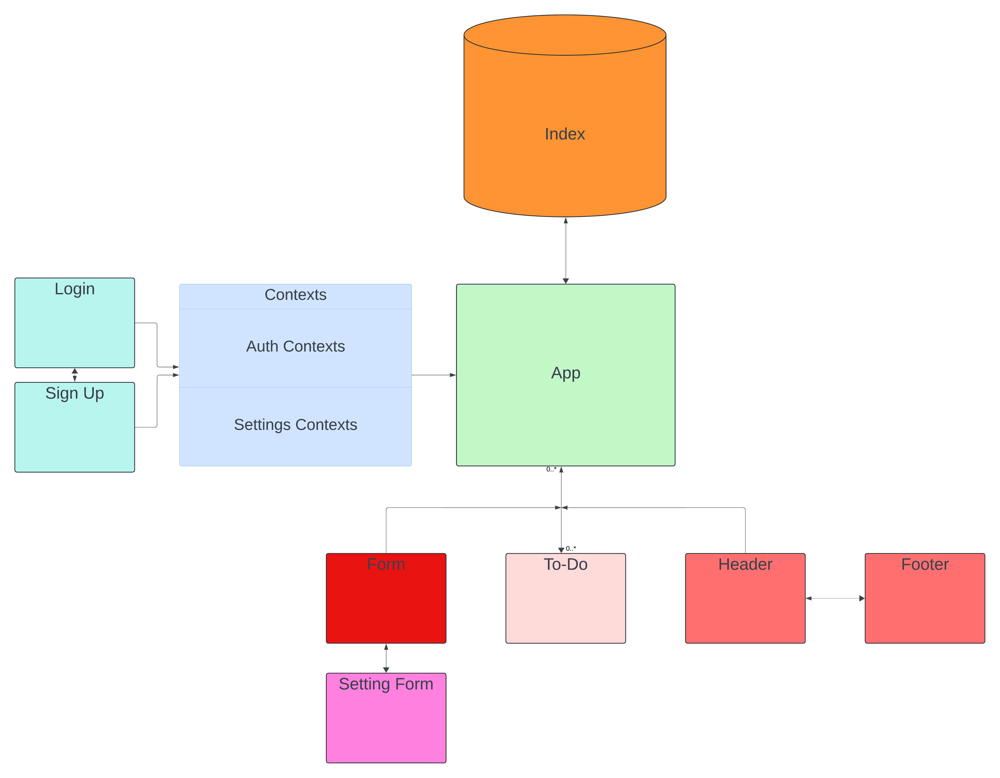

# To Do App

## UML

  

## Phase 1 Requirements

In Phase 1, we’re going to perform some refactoring of a Todo application built by another team. This application mixes application state and user settings at the top level and passes things around. It was a good proof of concept, but we need to make this production ready.

1. Create a Detailed UML.
2. Properly modularize the application into separate components, note the proposed file structure below.
3. Implement the Context API to make some basic application settings available to components.
4. Show three items by default.
5. Hide completed items by default.
6. Add the sort word ‘difficulty’ by default.
7. Style the application using the Mantine Component API.  
  
### Technical Requirements

* Implement the React context API for defining settings across the entire application.  

* Create React Context for managing application display settings and provide this at the application level.
* Add the following defaults to the context provider’s state, they will not be changeable in this lab.
* Display three items.
* Hide completed items using a boolean.
* Define “difficulty” as a default sort word to optionally use in the stretch goal.
* Consume and utilize context values throughout your components.
* Show a maximum of three items per screen by default in the <List /> component.
* Use the Mantine <Pagination /> component to allow users to navigate a list of items.
* Hide completed items in the list by default (the ability to show will be added in a later lab).

### Describe how global state is consumed by the components.
Global state is consumed by components using the `useContext` hook with the Context API or hooks like `useSelector` and `useDispatch` with state management libraries like Redux.

### Describe the operation of the hook: useForm().
The `useForm` hook manages form state and handles input changes and form submissions by initializing state, providing change handlers, and handling form validation and submission logic.
